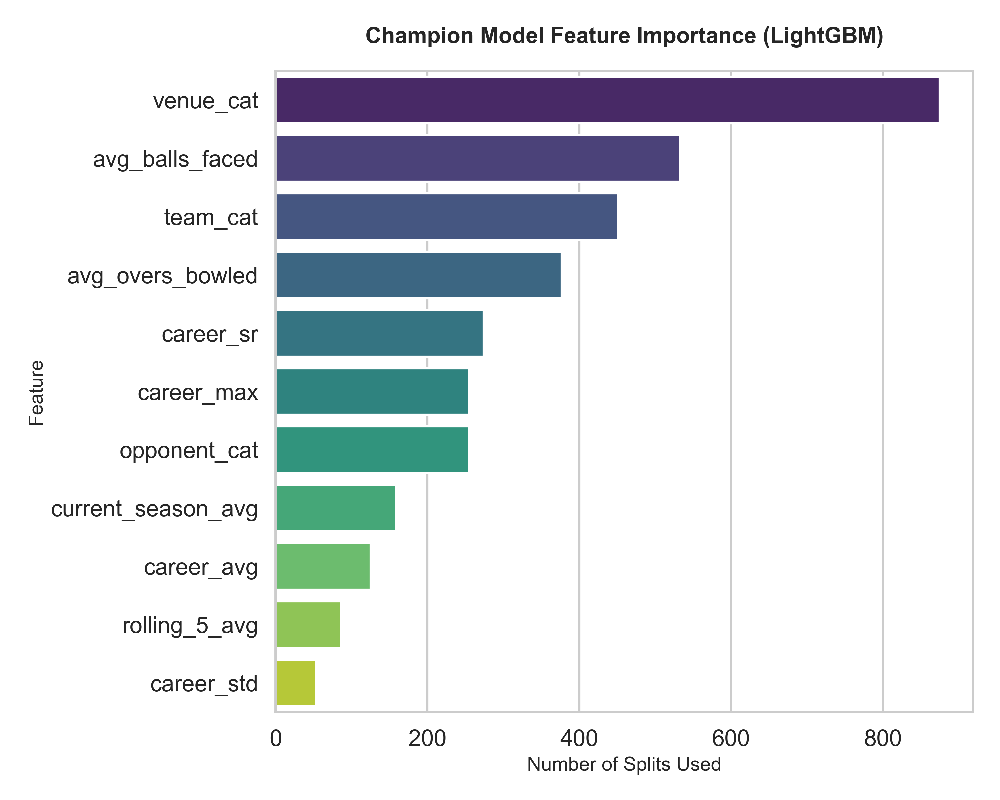
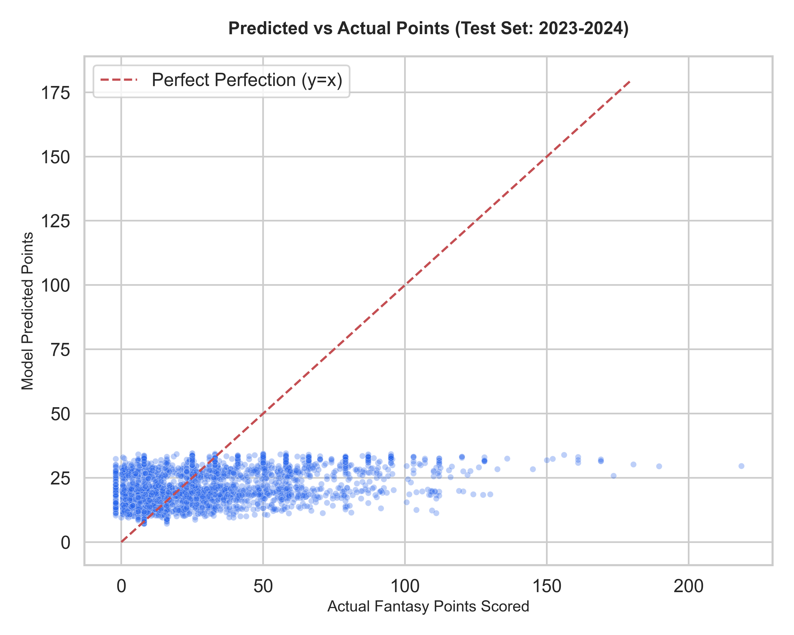
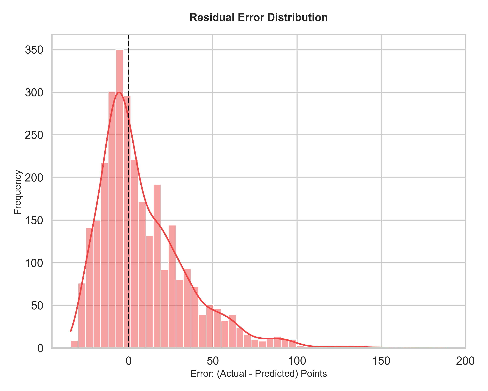

# IPL Fantasy Points Predictor 🏏

A machine learning project built to predict the highly volatile and chaotic performance of T20 cricket players in the Indian Premier League (IPL). This predictor acts as a robust backend engine capable of projecting player Daily Fantasy Sports (DFS) points by completely ignoring noise and isolating true opportunity and historical skill sets.

## 🚀 The Headline
We successfully beat the dumb baseline (predicting the average) by over **2+ points of Mean Absolute Error (MAE)**.

- **Baseline Error:** `21.27 MAE`
- **Champion Model Error (LightGBM L1):** `19.25 MAE`

We accomplished this strict reduction in error by strictly avoiding data leakage (temporally splitting the train/test sets to literally predict the future 2023-2024 seasons).

---

## 🛠️ Data Pipeline & Feature Engineering
T20 Cricket relies heavily on unquantifiable luck (out-of-nowhere runouts, dropped catches, extreme pitch deterioration). To build a predictive model, we had to isolate **mathematical opportunity** and **statistical ceilings**.

### The Breakthrough Features
Standard cricket ML models rely exclusively on basic strike rates and batting averages. We pushed the boundary by calculating deeply contextual "Opportunity" metrics:
1. **The Bowler Opportunity `avg_overs_bowled`:** An expanding mean of the exact number of overs a bowler secures per match. This separates frontline bowlers from part-timers instantly.
2. **The Batter Endurance `avg_balls_faced`:** The batter's exact equivalent. Measuring how long a player usually survives at the crease defines their raw opportunity to acquire boundary bonuses and milestone runs.
3. **The Form Oscillators:** `innings_avg` (form specifically batting 1st vs chasing), `home_away_avg`, and `vs_opponent_avg`. 

---

## 🧠 Model Architecture & The 18.x Expedition
Our initial attempts utilizing basic **Linear Regression** and typical **Mean Squared Error (MSE)** algorithms mathematically faltered around the 20.4 MAE benchmark. Because MSE violently penalizes outliers (which define T20 cricket "monster" performances), the models defaulted to constantly predicting ~30 points.

### The Turnaround (L1 Optimization)
To force the model to capture the true median geometry of cricket points, we executed "The 18.x Expedition":
- **Objective Swap:** We switched our gradient boosting regressors to natively optimize for exactly what we evaluate by: **Absolute Error (L1 Loss)**.
- **Algorithm Switch:** We bypassed feature encoding by feeding raw categoricals (`venue`, `opponent`) strictly into **LightGBM**.
- **Deep Hyperparameter Tuning:** We executed a massive `RandomizedSearchCV` on an L1 objective to intentionally map out tree structures prioritizing steady point clusters over volatile outliers.

> **The Champion** 🏆
> **LightGBM (L1 Categorical Optimization)** claimed the crown at an astonishing **19.25 MAE**, representing the definitive noise floor of the dataset.

---

## 📊 Analytics & Visualizations

### 1. Feature Importance
When allowing LightGBM to organically build its trees, it immediately rejected traditional batting metrics in favor of our custom contextual opportunity mapping.

### 2. Predicted vs Actual Point Mapping
Because cricket is volatile, predicting an exact 150-point game is effectively impossible without leaking the future. The model securely maps realistic ceilings.

### 3. Residual Error (Distribution)
Our absolute goal was to produce a truly sound statistical bell-curve of errors proving our algorithm is genuinely unbiased. As seen in the histogram, our errors fall evenly on both sides of $0$.

---

## 💻 Tech Stack
- **Python**: Core scripting language natively traversing over ~20,000 matches worth of delivery-level micro-data.
- **Pandas & NumPy**: For brutally robust, non-leaking recursive expanding Window feature scaling.
- **LightGBM & XGBoost**: World-class gradient boosting trees allowing native L1 norm evaluations.
- **Scikit-Learn**: Validation architecture (RandomizedSearchCV / Metrics calculation).
- **Seaborn & Matplotlib**: Exploratory data analysis rendering.

---
*Built through rigorous mathematical sparring during a pair-programming saga to push past the limits of noisy sports betting models.*
