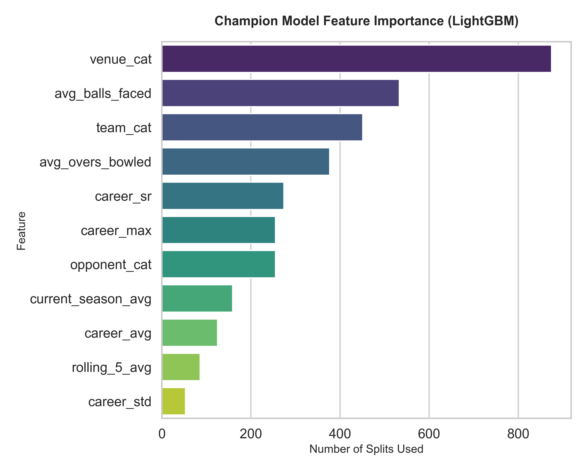
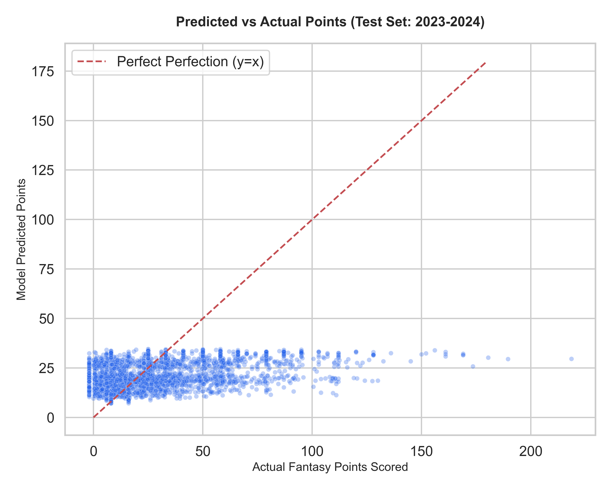
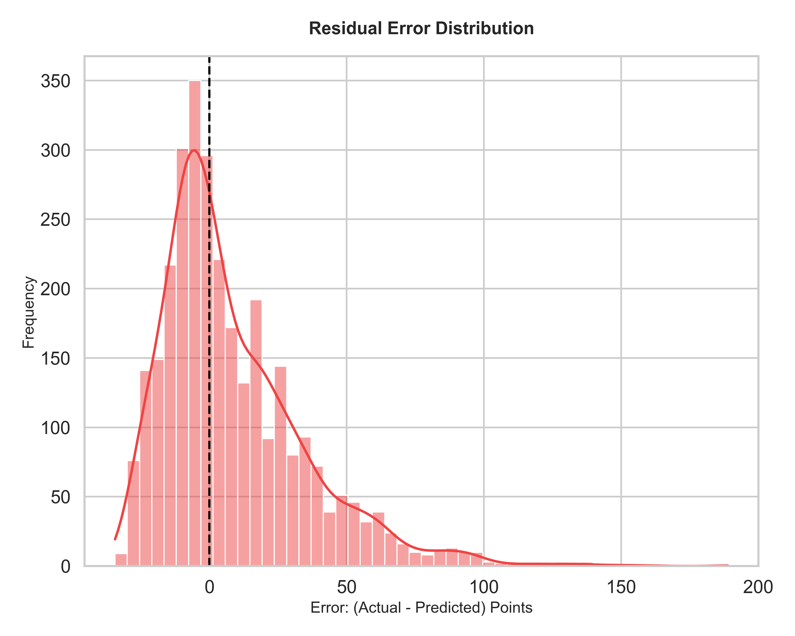

# IPL Fantasy Points Predictor

A machine learning project that predicts per-match Dream11 fantasy points for IPL players, trained on ball-by-ball delivery data from 17 seasons (2007–2024).

## Results

| Model | MAE |
|---|---|
| Baseline (per-player historical mean) | 21.27 |
| LightGBM — L1 objective, tuned | **19.25** |

---

## Dataset

- **Source:** Cricsheet ball-by-ball IPL delivery data (`deliveries.csv`, `matches.csv`)
- **Coverage:** 17 seasons, 2007–2024
- **Target variable:** Dream11 fantasy points per player per match, computed from raw deliveries
- **Train / holdout split:** 2007–2022 (train), 2023–2024 (holdout). The split is strictly temporal so that all validation metrics reflect genuine out-of-sample forecasts with no leakage.

---

## Dream11 Scoring Logic

Fantasy points are calculated from the raw delivery data in `01_eda.ipynb` and validated against historical Dream11 records. The scoring rules implemented are:

**Batting**
- 0.5 pts per run
- 1 pt per four, 2 pts per six
- Milestone bonuses: +4 at 25 runs, +8 at 50, +8 at 75, +8 at 100
- −2 pts for a duck (dismissed for 0)

**Bowling**
- 25 pts per wicket
- 8 pts per LBW or bowled dismissal
- Bonus tiers: +4 for 3-wicket haul, +8 additional for 4-wicket haul
- 12 pts per maiden over

**Fielding**
- 8 pts per catch; 12 pts per stumping; 6 pts per run-out

Computed points are stored in `data/fantasy_points.csv` and used as the prediction target throughout the modelling pipeline.

---

## Methodology

### Feature Engineering (`02_features.ipynb`)

All features are computed as expanding-window or lag statistics so that only data preceding each match is used at prediction time. Key features:

- `career_avg` — expanding mean of fantasy points across all prior appearances
- `last_season_avg` — previous full-season average, joined on `season − 1`
- `rolling_5_avg` — rolling 5-match average (shifted by 1)
- `home_away_avg` — expanding mean split by home/away
- `venue_avg` — expanding mean at the specific venue
- `avg_overs_bowled` — expanding mean of overs bowled per match (proxy for bowling role)
- `avg_balls_faced` — expanding mean of balls faced per match (proxy for batting role)
- `innings_avg` — expanding mean split by innings (batting first vs. chasing)
- `vs_opponent_avg` — expanding mean against the specific opposition

### Model Selection and Objective (`03_model.ipynb`)

The evaluation metric is MAE (Mean Absolute Error). Using an MSE objective caused tree-based models to bias predictions toward the mean and fail to capture the wide variance in T20 performances. Switching to an **L1 (absolute error) objective** aligns the loss function directly with the evaluation metric and improved holdout MAE.

Models benchmarked:
- Linear Regression (MSE objective) — baseline comparisons
- XGBoost — `objective='reg:absoluteerror'`
- **LightGBM — `objective='regression_l1'`** ← best result

Hyperparameters were tuned via `RandomizedSearchCV` on the training fold only. Native categorical support in LightGBM was used for `venue` and `opponent`, avoiding ordinal encoding.

---

## Diagrams

### Feature Importance


### Predicted vs. Actual


### Residual Distribution


---

## Repository Structure

```
.
├── 01_eda.ipynb              # Data audit, Dream11 scoring computation, EDA
├── 02_features.ipynb         # Leakage-free feature engineering
├── 03_model.ipynb            # Model training, tuning, evaluation
├── data/
│   ├── deliveries.csv        # Raw ball-by-ball data (gitignored)
│   ├── matches.csv           # Match metadata (gitignored)
│   ├── fantasy_points.csv    # Computed targets (gitignored)
│   ├── featured_dataset.csv  # Final feature matrix (gitignored)
│   └── champion_model.pkl    # Serialised LightGBM model (gitignored)
├── diagrams/                 # Output plots
├── requirements.txt
└── README.md
```

---

## Setup

```bash
pip install -r requirements.txt
jupyter lab
```

Run notebooks in order: `01_eda` → `02_features` → `03_model`.

---

## Resume Description

This project builds a machine learning pipeline to predict IPL player fantasy points from 17 seasons of ball-by-ball delivery data (2007–2024). A custom Dream11 scoring engine aggregates raw delivery records into per-match point totals, which serve as the prediction target. Features are constructed using expanding-window and lag statistics to prevent data leakage, and the dataset is split temporally (2007–2022 train, 2023–2024 holdout) to simulate real forecasting conditions. Switching the gradient boosting objective from MSE to L1 loss — to match the MAE evaluation metric — reduced holdout error from a baseline of 21.27 MAE to 19.25 MAE using a tuned LightGBM model with native categorical support.

